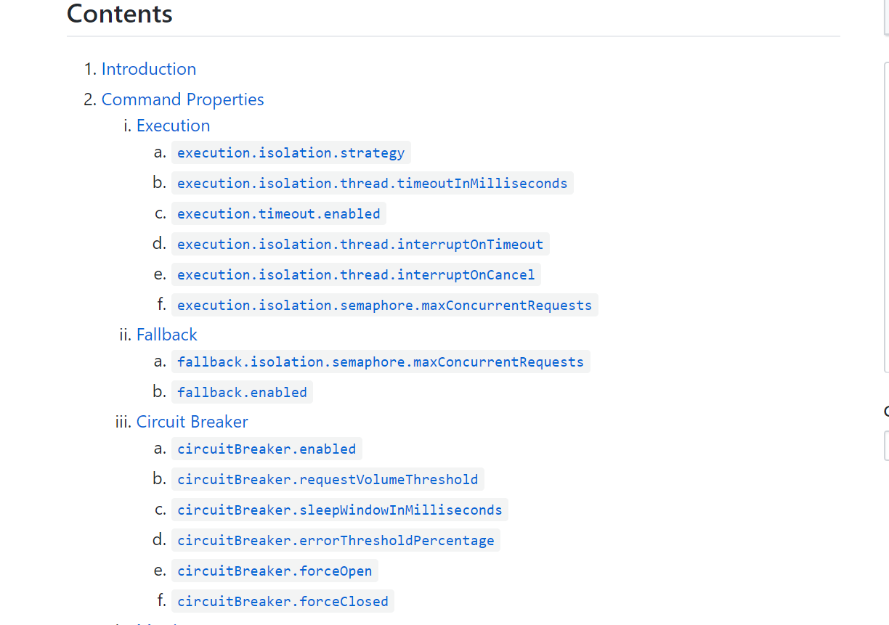
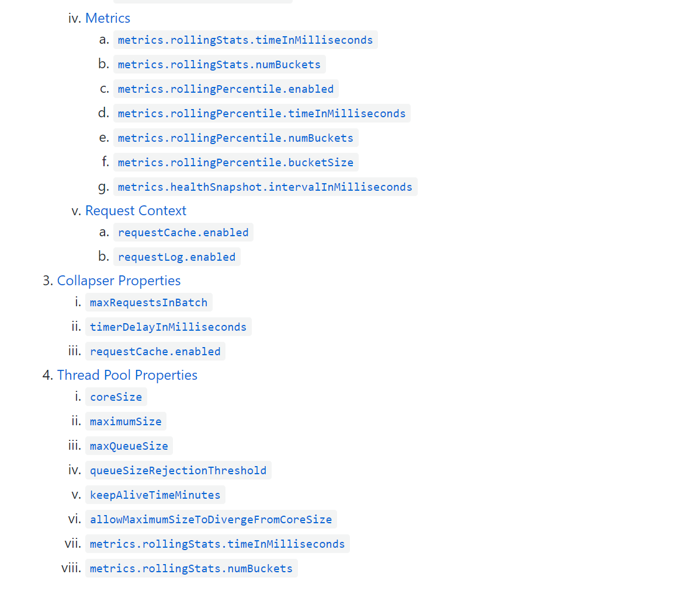

## Configuration 配置

### Execution配置 

|说明|Instance Property|Default Property|Default Value|Possible Values|
|---|---|---|---|---|
|线程隔离策略|hystrix.command.HystrixCommandKey.execution.isolation.strategy|hystrix.command.default.execution.isolation.strategy|THREAD|THREAD, SEMAPHORE|
|超时时间|hystrix.command.HystrixCommandKey.execution.isolation.thread.timeoutInMilliseconds|hystrix.command.default.execution.isolation.thread.timeoutInMilliseconds|1000||
|是否启用超时|hystrix.command.HystrixCommandKey.execution.timeout.enabled|hystrix.command.default.execution.timeout.enabled|true||
|线程隔离策略是SEMAPHORE，设置最大并发请求量|hystrix.command.HystrixCommandKey.execution.isolation.semaphore.maxConcurrentRequests|hystrix.command.default.execution.isolation.semaphore.maxConcurrentRequests|10||
|当发生超时的时候HystrixCommand.run()的执行是否可以被中断|hystrix.command.HystrixCommandKey.execution.isolation.thread.interruptOnTimeout|hystrix.command.default.execution.isolation.thread.interruptOnTimeout|true||
|当发生取消操作的时候HystrixCommand.run()的执行是否可以被中断|hystrix.command.HystrixCommandKey.execution.isolation.thread.interruptOnCancel|hystrix.command.default.execution.isolation.thread.interruptOnCancel|false||
||||||
||||||

### Fallback配置 

|说明|Instance Property|Default Property|Default Value|Possible Values|
|---|---|---|---|---|
|调用HystrixCommand.getFallback()方法的最大并发数，默认10|hystrix.command.HystrixCommandKey.fallback.isolation.semaphore.maxConcurrentRequests|hystrix.command.default.fallback.isolation.semaphore.maxConcurrentRequests|10||
|是否启用fallback机制|hystrix.command.HystrixCommandKey.fallback.enabled|hystrix.command.default.fallback.enabled|true||
||||||
||||||

### Circuit Breaker配置 

|说明|Instance Property|Default Property|Default Value|Possible Values|
|---|---|---|---|---|
|是否启用熔断机制，默认开启|hystrix.command.HystrixCommandKey.circuitBreaker.enabled|hystrix.command.default.circuitBreaker.enabled|true||
|触发熔断的请求量阈值，当并发请求量超过这个值时，将触发熔断，执行fallback|hystrix.command.HystrixCommandKey.circuitBreaker.requestVolumeThreshold|hystrix.command.default.circuitBreaker.requestVolumeThreshold|20||
|设置触发熔断的错误率百分比，当错误请求百分比超过这个值时，将触发熔断，执行fallback|hystrix.command.HystrixCommandKey.circuitBreaker.errorThresholdPercentage|hystrix.command.default.circuitBreaker.errorThresholdPercentage|50||
|当熔断触发时，等待超过这个值时，才允许新的请求进来，如果这个请求成功则关闭熔断|hystrix.command.HystrixCommandKey.circuitBreaker.sleepWindowInMilliseconds|hystrix.command.default.circuitBreaker.sleepWindowInMilliseconds|5000||
|强制开启熔断，拒绝所有请求|hystrix.command.HystrixCommandKey.circuitBreaker.forceOpen|hystrix.command.default.circuitBreaker.forceOpen|false||
|强制关闭熔断，允许所有请求忽略错误百分比设置|hystrix.command.HystrixCommandKey.circuitBreaker.forceClosed|hystrix.command.default.circuitBreaker.forceClosed|false||
||||||
||||||

### ThreadPool Properties配置 
> hystrix.command.HystrixCommandKey.execution.isolation.strategy的值为THREAD时才有效

|说明|Instance Property|Default Property|Default Value|Possible Values|
|---|---|---|---|---|
|线程池中核心线程数的个数(即最小线程个数)|hystrix.threadpool.HystrixThreadPoolKey.coreSize|hystrix.threadpool.default.coreSize|10||
|线程池中最大线程数的个数|hystrix.threadpool.HystrixThreadPoolKey.maximumSize|hystrix.threadpool.default.maximumSize|10||
|待执行任务队列容量，不建议修改该值|hystrix.threadpool.HystrixThreadPoolKey.maxQueueSize|hystrix.threadpool.default.maxQueueSize|−1||
|待执行任务数超过这个阈值时直接拒绝|hystrix.threadpool.HystrixThreadPoolKey.queueSizeRejectionThreshold|hystrix.threadpool.default.queueSizeRejectionThreshold|5||
|线程空闲时间，当maximumSize>coreSize时有效|hystrix.threadpool.HystrixThreadPoolKey.keepAliveTimeMinutes|hystrix.threadpool.default.keepAliveTimeMinutes|1||
||||||
||||||
||||||

