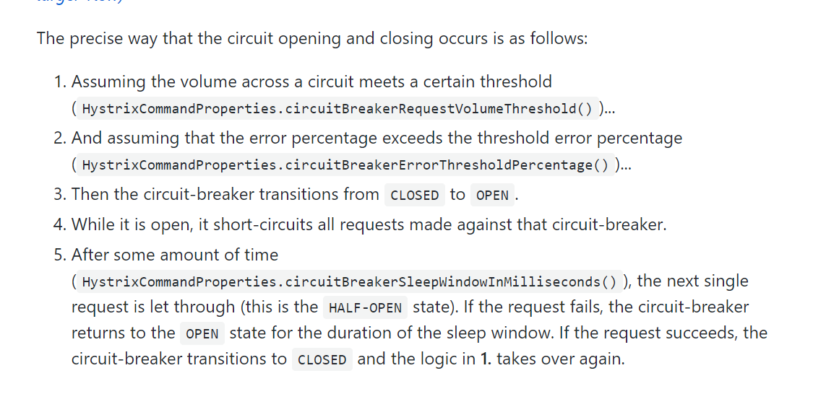

## How it Works

### 把你的请求封装成一个HystrixCommand或者HystrixObservableCommand对象

> HystrixCommand command = new HystrixCommand(arg1, arg2);

> HystrixObservableCommand command = new HystrixObservableCommand(arg1, arg2);

#### Execute the Command
> execute() — blocks, then returns the single response received from the dependency (or throws an exception in case of an error).

> queue() — returns a Future with which you can obtain the single response from the dependency.

> observe() — subscribes to the Observable that represents the response(s) from the dependency and returns an Observable that replicates that source Observable.

> toObservable() — returns an Observable that, when you subscribe to it, will execute the Hystrix command and emit its responses.

> The synchronous call execute() invokes queue().get(). queue() in turn invokes toObservable().toBlocking().toFuture().

### Is the Circuit Open?
> 如果熔断被触发，command不会被执行，直接执行fallback。

### Is the Thread Pool/Queue/Semaphore Full?
> 如果与这个command关联的线程池及任务队列(或者是semaphore如果不是线程池)已满。直接执行fallback。

### HystrixObservableCommand.construct() or HystrixCommand.run()

> If the run() or construct() method exceeds the command’s timeout value, the thread will throw a TimeoutException (or a separate timer thread will, if the command itself is not running in its own thread).

> 当construct()或者run()的执行超过command设置的timeout值时，这个线程将会抛出TimeoutException(或者在一个单独的timer thread，不是在线程中执行)，直接执行fallback。

> Please note that there's no way to force the latent thread to stop work.

> 请注意，无法强制背后的线程停止工作（当发生fallback的时候）。

> Hystrix command返回TimeoutException超时，但Hystrix thread pool的线程还是在执行的，还是被占用的，这就会出现Hystrix负载是正常的，但线程池已经满了。

### 熔断触发及恢复机制

### Isolation 隔离级别 (Thread或者Semaphore)

> 你可以依赖底层来实现超时(不推荐)，Hystrix采用自己的线程池或者Timer Thread来实现超时.

#### Benefits of Thread Pools 通过线程池来实现隔离的好处

> 1.完全从底层超时依赖中剥离开来。各个依赖的线程池之间互不影响，其中一个依赖的线程池满了不会影响其他依赖。

> 2.对于某个依赖中新加入的库只会产生很小的影响。就算新库发生问题，也不会影响其他应用。

> 3.当某个client从失败中恢复过来，线程池将会清空，应用就能恢复正常，无须重启整个Tomcat。

> 当某个客户端库配置发生错误时，可以很快通过increased errors, latency, timeouts, rejections监测到。

> In short, the isolation provided by thread pools allows for the always-changing and dynamic combination of client libraries and subsystem performance characteristics to be handled gracefully without causing outages.

> 注意：Despite the isolation a separate thread provides, your underlying client code should also have timeouts and/or respond to Thread interrupts so it can not block indefinitely and saturate the Hystrix thread pool.

#### 注意: 尽管提供了单独的线程隔离级别，你的底层应用也需要设置超时时间或者响应线程中断，为了防止无限阻塞及填满整个Hystrix thread pool。

### Thread Pools的缺点
> 增加了计算机对线程队列、调度、上下文切换的开销。

### Semaphores
> it does not allow for timing out and walking away.

> Note: if a dependency is isolated with a semaphore and then becomes latent, the parent threads will remain blocked until the underlying network calls timeout.

> Semaphore rejection will start once the limit is hit but the threads filling the semaphore can not walk away.

