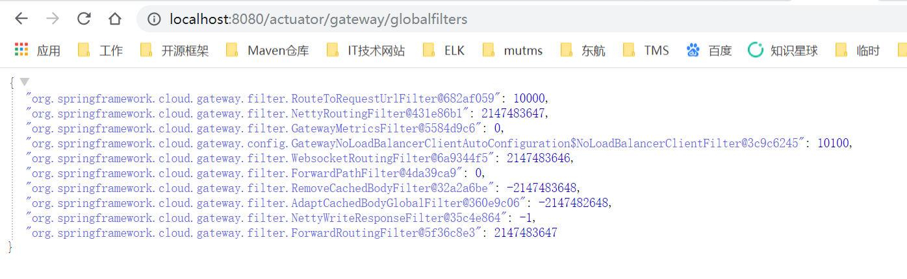
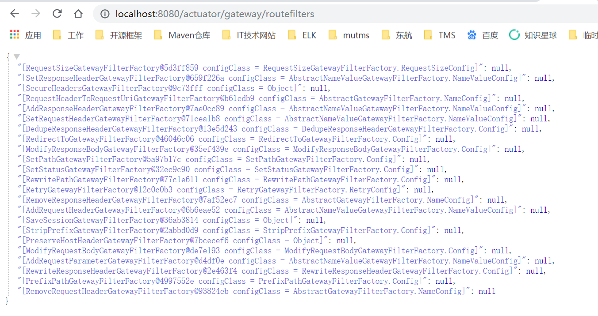
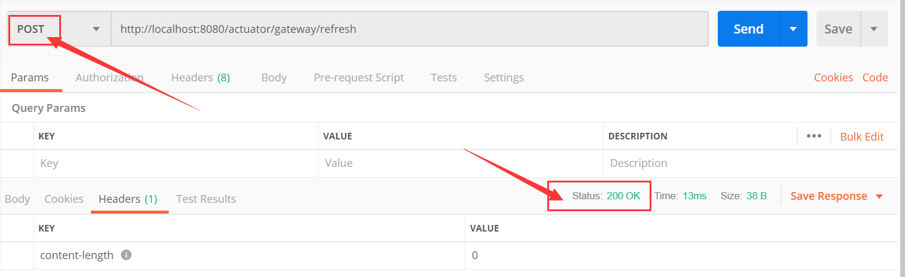
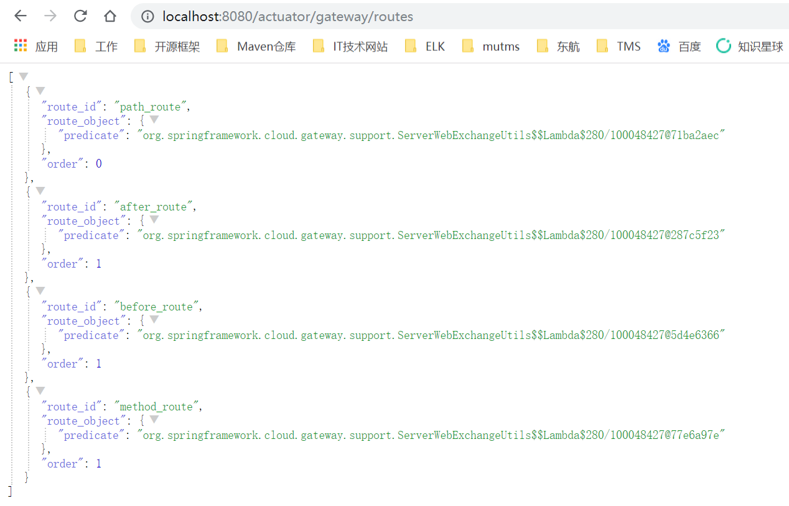
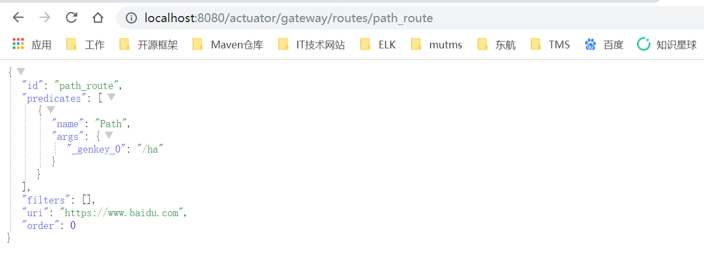
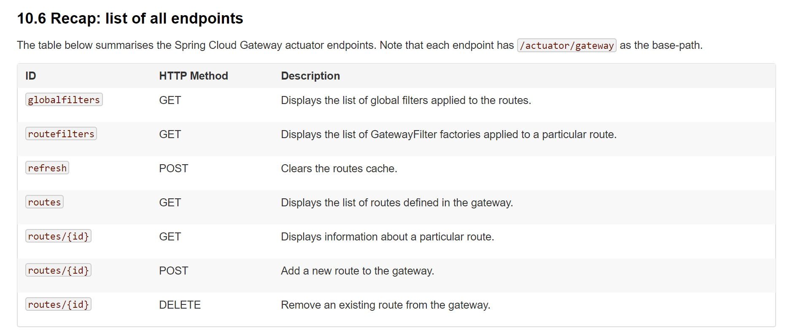
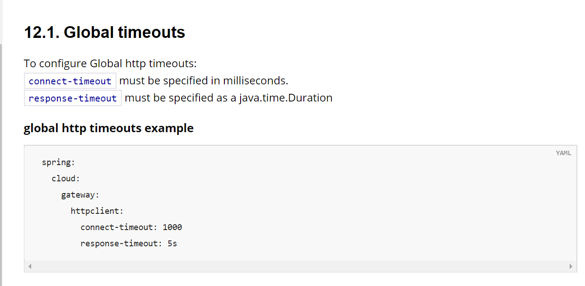
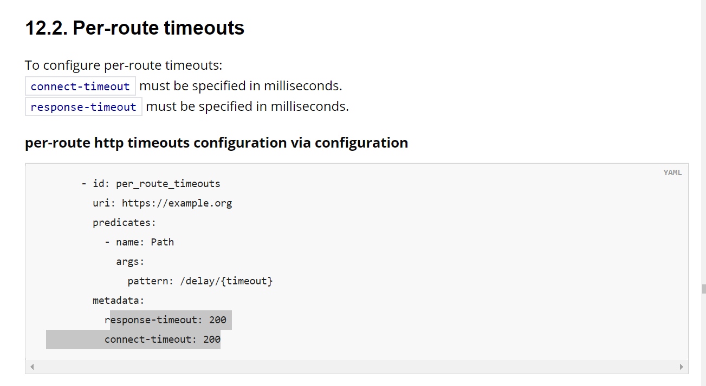

## Gateway

### 引入依赖

```xml
<dependency>
    <groupId>org.springframework.cloud</groupId>
    <artifactId>spring-cloud-starter-gateway</artifactId>
</dependency>
```

#### 关闭gateway
> spring.cloud.gateway.enabled=false

### Important
> Spring Cloud Gateway is built upon Spring Boot 2.0, Spring WebFlux, and Project Reactor. As a consequence many of the familiar synchronous libraries (Spring Data and Spring Security, for example) and patterns you may not apply when using Spring Cloud Gateway. 

#### Gateway是基于Netty的无法运行在传统的Servlet容器，或者打war包执行。
> Spring Cloud Gateway requires the Netty runtime provided by Spring Boot and Spring Webflux. It does not work in a traditional Servlet Container or built as a WAR.


### Glossary 术语

#### Route 路由, 由一个ID, 一个目标URI以及一系列的predicates和一系列的filters组成。当一个路由所有的predicate都满足的时候这个路由才能匹配
> Route the basic building block of the gateway. It is defined by an ID, a destination URI, a collection of predicates and a collection of filters. A route is matched if aggregate predicate is true.

#### Predicate 断言，用于判断一个请求能否进入指定Route
> This is a Java 8 Function Predicate. The input type is a Spring Framework ServerWebExchange. This allows developers to match on anything from the HTTP request, such as headers or parameters.

#### Filter 过滤器, 用于修改requests和responses
> These are instances Spring Framework GatewayFilter constructed in with a specific factory. Here, requests and responses can be modified before or after sending the downstream request.

### How It Works


### RoutePredicateHandlerMapping 


### Actuator

#### Enables gateway functionality.
> management.endpoint.gateway.enabled=true


> management.endpoints.web.exposure.include=gateway

|endpoint|请求方式|说明|URL|
|---|---|---|---|
|globalfilters|GET|全局过滤器|http://localhost:8080/actuator/gateway/globalfilters|
|routefilters|GET|路由过滤器|http://localhost:8080/actuator/gateway/routefilters|
|refresh|POST|清空路由缓存，必须是POST请求, 返回200，没有内容|http://localhost:8080/actuator/gateway/refresh|
|routes|GET|获取已定义的路由信息|http://localhost:8080/actuator/gateway/routes|
|route_id|GET|获取指定路由信息, 只在yml配置文件格式配置路由的时候生效，使用java配置的时候无效|http://localhost:8080/actuator/gateway/routes/path_route|
||||

#### globalfilters
> 格式：过滤器名 + ： + Order



#### routefilters
> 格式：工厂 + configClass 


#### refresh
> To clear the routes cache, make a POST request to /actuator/gateway/refresh. The request returns a 200 without response body.



#### routes
> 格式：工厂 + configClass 


#### {route_id}
> /actuator/gateway/routes/{route_id}



### endpoints列表



### 自定义GatewayFilter

#### 方式一：实现GatewayFilter接口, 需要通过java代码方式配置

```java
public class PreGatewayFilter implements GatewayFilter, Ordered {
    @Override
    public Mono<Void> filter(ServerWebExchange exchange, GatewayFilterChain chain) {
        System.out.println("this is PreGatewayFilter");
        return chain.filter(exchange);
    }

    @Override
    public int getOrder() {
        return 0;
    }
}

```

```
    @Bean
    public RouteLocator customRouteLocator(RouteLocatorBuilder builder)
    {
        return builder.routes()
                .route("path_route", r -> {
                    return r.order(0).path("/ha").filters(f -> f.filter(new PreGatewayFilter())).uri(URL);
                })
                .build();
    }
```

#### 方式二: 继承AbstractGatewayFilterFactory类, 需要通过yml方式配置，无法通过java代码方式配置。

```java
@Component
public class PreGatewayFilterFactory extends AbstractGatewayFilterFactory<PreGatewayFilterFactory.Config> {
    public PreGatewayFilterFactory() {
        super(Config.class);
    }

    /**
     * 提供Config中的字段名称及顺序，为了能够动态绑定
     *
     * @return
     */
    @Override
    public List<String> shortcutFieldOrder() {
        return Arrays.asList("name");
    }

    @Override
    public GatewayFilter apply(Config config) {
        return ((exchange, chain) -> {
            System.out.println("PreGatewayFilter, name:" + config.getName());
            return chain.filter(exchange);
        });
    }

    public static class Config{
        private String name;

        public String getName() {
            return name;
        }

        public void setName(String name) {
            this.name = name;
        }
    }
}
```

```yml
spring:
  cloud:
    gateway:
      metrics:
        enabled: true
      routes:
      - id: path_route
        uri: https://www.baidu.com/
        filters:
        - Pre=zhangsan
        predicates:
        - Path=/ha
```


### 超时设置
#### 全局超时设置


#### 每个路由超时设置



### 网关超时、线程池配置 org.springframework.cloud.gateway.config.HttpClientProperties


org.springframework.cloud.gateway.config.HttpClientProperties
org.springframework.cloud.gateway.config.GatewayProperties
org.springframework.cloud.gateway.actuate.GatewayControllerEndpoint

org.springframework.boot.actuate.autoconfigure.endpoint.web.WebEndpointProperties

## 所有支持的配置都在这里
> C:/Users/wujinqing/.m2/repository/org/springframework/cloud/spring-cloud-gateway-core/2.1.2.RELEASE/spring-cloud-gateway-core-2.1.2.RELEASE.jar!/META-INF/spring-configuration-metadata.json


